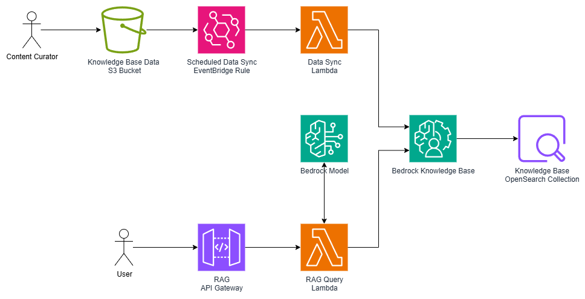

# cf-simple-bedrock-rag

This project implements a basic Retrieval-Augmented Generation (RAG) solution using AWS Bedrock, S3, OpenSearch Serverless, Lambda, API Gateway, and EventBridge. The infrastructure is defined using AWS CloudFormation.

## Architecture

The following diagram illustrates the architecture of the RAG application:



### Components

The project is divided into five CloudFormation stacks, each responsible for a specific part of the infrastructure:

1.  **`01-s3-bucket.yaml`**: Deploys an S3 bucket that serves as the data store for the documents that will be used by the Bedrock Knowledge Base.

2.  **`02-opensearch.yaml`**: Sets up an Amazon OpenSearch Serverless collection to act as the vector database. This stack also creates the necessary IAM roles and policies for Bedrock to access the S3 bucket and the OpenSearch collection, and to invoke the embedding models.

3.  **`03-bedrock-knowledgebase.yaml`**: Creates the AWS Bedrock Knowledge Base itself. It links the S3 bucket as the data source and the OpenSearch Serverless collection as the vector store. It's configured to use the `amazon.titan-embed-text-v2:0` model for creating vector embeddings.

4.  **`04-lambda-eventbridge.yaml`**: Deploys a Lambda function and an EventBridge rule. The EventBridge rule periodically triggers the Lambda function to start an ingestion job in the Bedrock Knowledge Base. This job syncs the data from the S3 bucket, ensuring the knowledge base is kept up-to-date with the latest documents.

5.  **`05-api-gateway-lambda.yaml`**: Exposes the RAG functionality through a public API. It creates an API Gateway with a `/query` endpoint that triggers a Lambda function. This Lambda function receives a user's query, retrieves relevant context from the Bedrock Knowledge Base, and then uses the `amazon.titan-text-lite-v1` model to generate a final answer based on the retrieved context.

## Curation Workflow

1.  **Data Ingestion**: Documents are uploaded to the S3 bucket.
2.  **Data Sync**: The EventBridge rule triggers the sync Lambda on a schedule.
3.  **Ingestion Job**: The sync Lambda starts an ingestion job in the Bedrock Knowledge Base.
4.  **Vectorization & Storage**: The Knowledge Base reads the documents from S3, uses the Titan embedding model to convert the text into vector embeddings, and stores these embeddings in the OpenSearch Serverless vector index.

## Querying Workflow
1.  **Querying**: A user sends a `POST` request with a query to the API Gateway endpoint.
2.  **Retrieval**: The query Lambda is invoked. It queries the Bedrock Knowledge Base to retrieve the most relevant document chunks based on the user's query.
3.  **Generation**: The Lambda function constructs a prompt containing the user's query and the retrieved context. It then calls the Titan text generation model to generate a human-like answer.
4.  **Response**: The generated answer is returned to the user through the API Gateway.

```
curl --location 'https://0000000000.execute-api.ap-southeast-2.amazonaws.com/prod/query' \
--header 'Content-Type: application/json' \
--data '{
    "query": "Does Aydan have any pets?"
}'
```